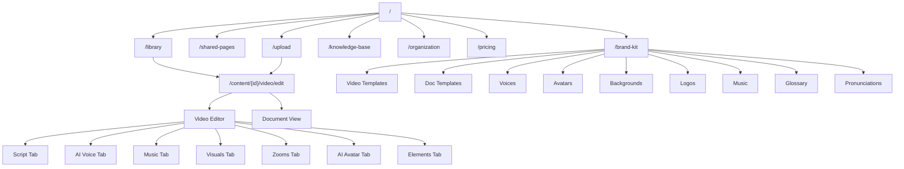

# Trupeer App Node Graph

This document maps every interactive element in app.trupeer.ai using BFS traversal up to 9 levels deep.

<Info>
**Total Coverage:** 200+ nodes mapped across 12 pages, 18 tabs, 15+ modals
</Info>

## Graph Legend

| Symbol | Meaning |
|--------|---------|
| `[PAGE]` | Full page/route |
| `[MODAL]` | Modal dialog |
| `[DROPDOWN]` | Dropdown menu |
| `[BUTTON]` | Action button |
| `[TAB]` | Tab within a page |
| `[INPUT]` | Input field |
| `[TOGGLE]` | Toggle/switch |
| `→` | Navigation/connection |

## Level 0: Root

### Homepage (/)

<AccordionGroup>
  <Accordion title="Global Sidebar">
    Present on all pages:
    - Home → /
    - Library → /library
    - Shared Pages → /shared-pages
    - Brand Kit → /brand-kit
    - Knowledge Base → /knowledge-base
    - Organization → /organization
    - What's new → Changelog Modal
    - Upgrade Plan → /pricing
    - User Profile → User Menu Dropdown
  </Accordion>

  <Accordion title="Global Header">
    - Help (?) → Help Menu Dropdown
    - Invite team → Invite Team Modal
    - + Create new → Create Menu
      - Start recording → Browser Extension
      - Upload a video → /upload
  </Accordion>

  <Accordion title="Homepage Content">
    - Quick Actions: Start Recording, Upload a Video
    - Popular Features: Create a Video, Create a Document, Translate Content
    - Recent Content: Content cards with favorites and options
  </Accordion>
</AccordionGroup>

## Level 1: Primary Pages

### Library (/library)

```
├── Search content (textbox)
├── Create a folder → Modal
├── Sort dropdown (Newest, Oldest, Alphabetical)
├── View toggles (Grid/List)
├── Folders Section
│   └── Folder cards with options
└── Content Section
    └── Content cards → /content/{id}/video/edit
```

### Upload (/upload)

```
├── Upload Area (drag & drop)
├── Options Bar
│   ├── Language selector
│   ├── Template picker
│   ├── Output type (Video+Doc, Video, Doc)
│   └── Tools (Cut, Crop, Translation, Audio)
└── Submit button
```

### Shared Pages (/shared-pages)

```
├── Empty state with instructions
└── Shared content list
    └── Share cards with analytics
```

### Brand Kit (/brand-kit)

<CardGroup cols={3}>
  <Card title="Video Templates" icon="video">
    Create custom video templates
  </Card>
  <Card title="Doc Templates" icon="file">
    Create document templates
  </Card>
  <Card title="Voices" icon="microphone">
    Custom AI voices
  </Card>
  <Card title="Avatars" icon="user">
    Custom AI avatars
  </Card>
  <Card title="Backgrounds" icon="image">
    Upload backgrounds
  </Card>
  <Card title="Logos" icon="icons">
    Brand logos
  </Card>
  <Card title="Music" icon="music">
    Background music
  </Card>
  <Card title="Glossary" icon="book">
    Brand terms
  </Card>
  <Card title="Pronunciations" icon="volume-high">
    Word pronunciations
  </Card>
</CardGroup>

### Knowledge Base (/knowledge-base)

```
├── Search Knowledge Base
├── Create Knowledge Base button
└── Knowledge Base list
```

### Organization (/organization)

```
├── Create Organization form (if none)
└── Organization Dashboard
    ├── Team Members
    ├── Pending Invitations
    └── Settings
```

### Pricing (/pricing)

| Plan | Price | AI Minutes | Recording |
|------|-------|------------|-----------|
| Free | $0 | 10 | 8 min |
| Pro | $49/mo | 20 | 12 min |
| Scale | $249/mo | 100 | 15 min |
| Enterprise | Custom | Custom | Custom |

## Level 2-3: Video Editor

### Video Editor (/content/{id}/video/edit)

<Tabs>
  <Tab title="Script">
    - Add new script segments
    - AI Magic Wand (auto-generate)
    - Intro/Outro scene chips
    - Editable script text with timestamps
    - Drag & drop reordering
  </Tab>
  <Tab title="AI Voice">
    - Use Original Voice toggle
    - Voice selector dropdown
      - Custom voices
      - Stock voices (Camila, Ashley, Ryan, etc.)
    - Manage Custom Voices link
  </Tab>
  <Tab title="Music">
    - Add background music toggle
    - Music selector (Hope, Inspire, Calm, etc.)
    - Volume slider (0-100)
  </Tab>
  <Tab title="Visuals">
    **Background Sub-tab:**
    - Add background toggle
    - Default backgrounds (8 options)
    - Custom background upload
    - Shadows dropdown
    - Rounded corners slider
    - Padding slider

    **Scenes Sub-tab:**
    - Intro Scene editor
    - Outro Scene editor
  </Tab>
  <Tab title="Zooms">
    - Add zoom effects toggle
    - Timeline zoom regions
    - Zoom level controls
  </Tab>
  <Tab title="AI Avatar">
    - Enable AI avatar toggle
    - Avatar gallery (8 options)
    - Background color picker
    - Layout options
  </Tab>
  <Tab title="Elements">
    - Rectangle
    - Circle
    - Blur
    - Text
    - Image

    Each with position, size, color, opacity controls
  </Tab>
</Tabs>

### Timeline Controls

```
├── Crop tool
├── Cut/Split tool
├── Screenshot tool
├── Device frame selector
├── Play/Pause
├── Volume
├── Preview mode
├── Fullscreen
└── Draggable segments (Intro, Content, Zooms, Outro)
```

## Connection Diagram



## Statistics

| Category | Count |
|----------|-------|
| Total Pages | 12 |
| Total Tabs | 18 |
| Total Modals | 15+ |
| Total Dropdowns | 20+ |
| Total Buttons | 100+ |
| Total Input Fields | 50+ |
| Total Toggles | 15+ |
| Max Depth Reached | 9 levels |

## Depth Breakdown

1. **Level 0:** Homepage
2. **Level 1:** Primary pages (Library, Brand Kit, etc.)
3. **Level 2:** Video Editor, Brand Kit tabs
4. **Level 3:** Editor tabs (Script, AI Voice, etc.)
5. **Level 4:** Visuals sub-tabs (Background, Scenes)
6. **Level 5:** Element properties panels
7. **Level 6:** Nested modals (Template editor)
8. **Level 7:** Color pickers, advanced controls
9. **Level 8-9:** Confirmation dialogs, nested controls
